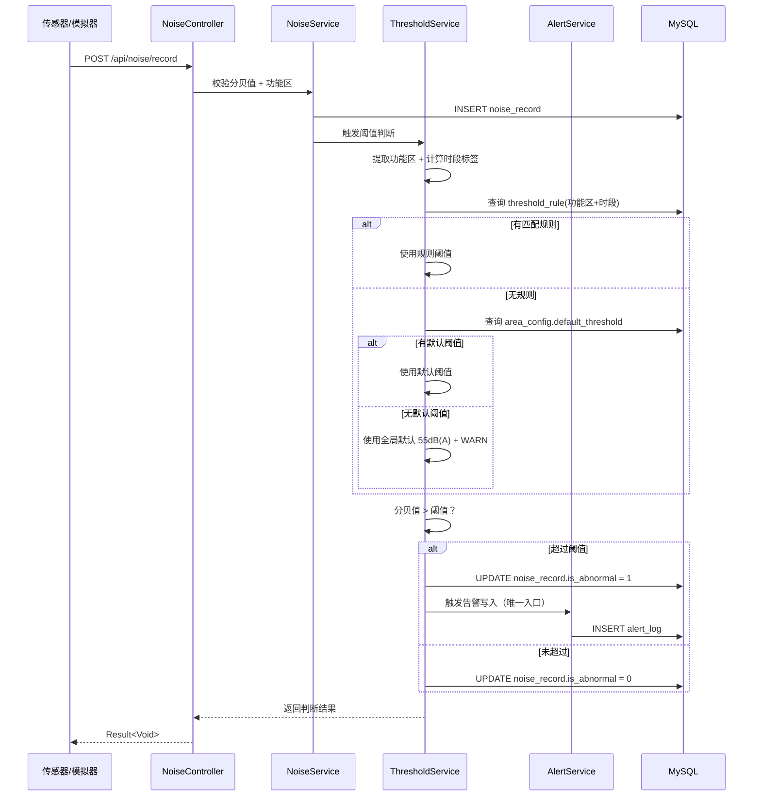
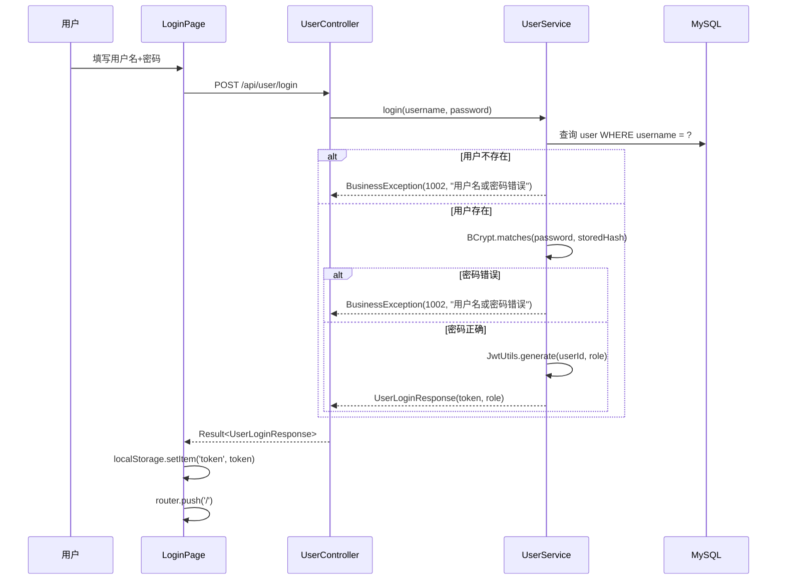
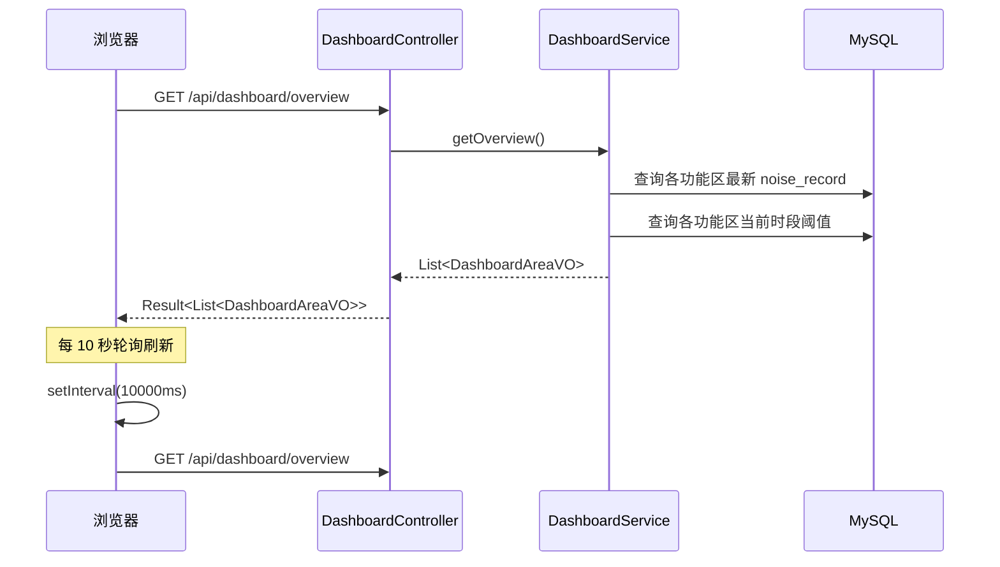
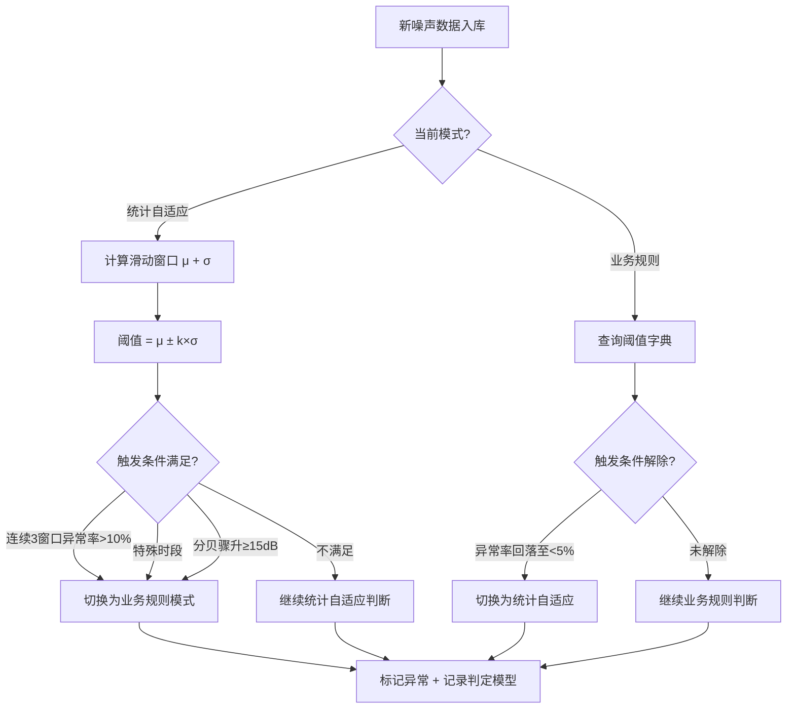
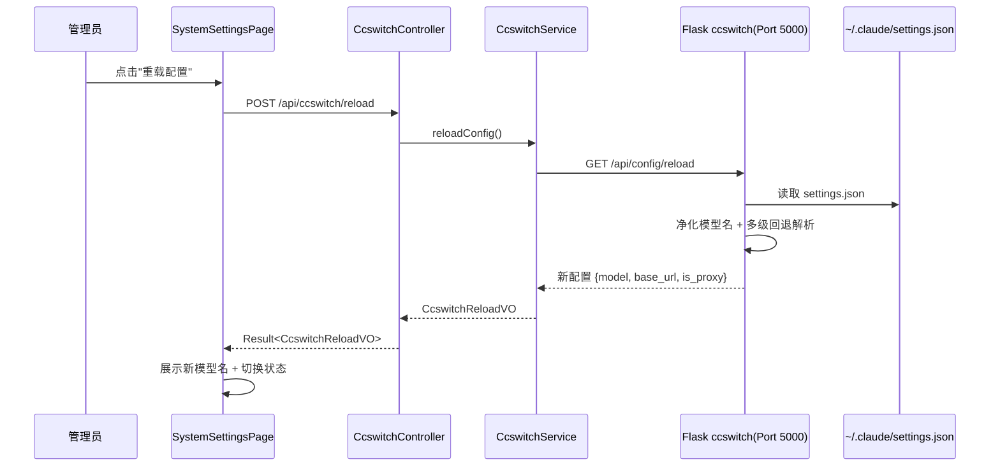

# 校园噪音分贝预警员系统 - 概要设计

## 1. 系统架构

### 1.1 整体架构

```
┌─────────────────────────────────────────────────┐
│                   前端 (Vue 3.5.34)              │
│  ┌─────────┐ ┌──────────┐ ┌──────────────────┐  │
│  │ LoginPage│ │DashboardPage│ │NoiseMonitorPage │  │
│  └─────────┘ └──────────┘ └──────────────────┘  │
│  ┌─────────────┐ ┌──────────────┐               │
│  │AlertHistoryPage│ │AreaConfigPage│  ...        │
│  └─────────────┘ └──────────────┘               │
│  Axios (api/request.js) + Pinia (stores/)        │
│  Element Plus 2.13.7 + ECharts (P1-3)            │
└──────────────────┬──────────────────────────────┘
                   │ HTTP REST /api/*
                   │ JWT Bearer Token
┌──────────────────▼──────────────────────────────┐
│              后端 (SpringBoot 3.5.14)            │
│  ┌──────────────────────────────────────────┐   │
│  │         Controller 层 (10 个)             │   │
<!-- R-02-issue-5: 低 - 架构图写"8个"但实际10个Controller，已修正为10 -->
<!-- R-02-issue-6: 低 - 架构图缺少SpringBoot→ccswitch HTTP连线，建议补充 -->
│  │  UserController / NoiseController / ...   │   │
│  └──────────────┬───────────────────────────┘   │
│  ┌──────────────▼───────────────────────────┐   │
│  │          Service 层 (业务逻辑)             │   │
│  │  UserService / NoiseService /             │   │
│  │  ThresholdService / AlertService /        │   │
│  │  StatisticsService / ReportService /      │   │
│  │  AreaConfigService / CcswitchService      │   │
│  └──────────────┬───────────────────────────┘   │
│  ┌──────────────▼───────────────────────────┐   │
│  │          Mapper 层 (MyBatis-Plus 3.5.15)  │   │
│  │  BaseMapper + LambdaQueryWrapper          │   │
│  └──────────────┬───────────────────────────┘   │
│  ┌──────────────▼───────────────────────────┐   │
│  │     Interceptor (JWT 校验 LoginInterceptor)│   │
│  │     GlobalExceptionHandler                │   │
│  └──────────────────────────────────────────┘   │
└──────────────────┬──────────────────────────────┘
                   │ JDBC
┌──────────────────▼──────────────────────────────┐
│            MySQL 8.4 LTS (数据库)                │
│  user / noise_record / threshold_rule /          │
│  alert_log / area_config / report               │
└─────────────────────────────────────────────────┘

┌ - - - - - - - - - - - - - - - - - - - - - - - - ┐
│     ccswitch 配置服务 (Flask · P2 可选加分项)     │
│     Port 5000 · 读取 ~/.claude/settings.json     │
│     提供 AI 模型配置热更新 + 阈值参数管理          │
│     参考: ocsjs-ai-answer-service/ccswitch.py    │
└ - - - - - - - - - - - - - - - - - - - - - - - - ┘
```

### 1.2 技术架构分层

| 层 | 技术 | 职责 |
|---|------|------|
| 表现层 | Vue 3.5 + Element Plus + ECharts | 用户交互、数据可视化、表单校验 |
| 通信层 | Axios + JWT Bearer Token | HTTP 请求封装、token 注入、统一错误拦截 |
| 控制层 | SpringBoot Controller + `@Valid` | 参数校验、路由转发、`Result<T>` 包装 |
| 业务层 | SpringBoot Service + `BusinessException` | 业务逻辑、阈值计算、告警判断、权限校验 |
| 持久层 | MyBatis-Plus `BaseMapper` + `LambdaQueryWrapper` | 数据访问、分页查询、条件筛选 |
| 数据层 | MySQL 8.4 LTS | 数据持久化、唯一索引防重、乐观锁 |
| 配置服务 | Python Flask + ccswitch.py | AI 模型配置读取、热更新（P2 加分项） |

### 1.3 ccswitch 配置服务架构（P2 加分项 · 参考 ocsjs-ai-answer-service）

ccswitch 配置服务是一个独立的 Python Flask 微服务（Port 5000），负责从 Claude Code 的 `~/.claude/settings.json` 实时读取 AI 模型配置和阈值参数，为主系统提供配置热更新能力。

**运行模式**（两种部署方式）：

| 模式 | 说明 | 启动方式 |
|------|------|---------|
| 嵌入式 | Flask 服务集成在主项目 `ccswitch_service/` 目录下 | `python app.py`（独立启动） |
| 参考式 | 参考 ocsjs-ai-answer-service 的完整实现模式 | 见 `ccswitch_service/app.py` 实现 |

**核心模块**（`ccswitch_service/` 目录）：

| 模块 | 文件 | 职责 |
|------|------|------|
| Flask 主应用 | `app.py` | HTTP API 端点：`/api/health`（健康检查）、`/api/config/reload`（重载配置） |
| ccswitch 读取 | `ccswitch.py` | 从 `~/.claude/settings.json` 读取 API 配置，支持 ccswitch 代理 / 直连双模式 |
| 配置管理 | `config.py` | 优先 ccswitch、回退 `.env`，运行时热重载 |
| 阈值规则存储 | `threshold_rules.json` | 动态阈值规则持久化配置（JSON 文件） |

**ccswitch.py 核心能力**（对齐参考实现 ocsjs-ai-answer-service/ccswitch.py）：

1. **配置源发现**：自动查找 `~/.claude/settings.json` → 回退 `settings.local.json`
2. **双模式支持**：ccswitch 本地代理（127.0.0.1:15721）和直连 API（如 api.deepseek.com）
3. **模型名净化**：去除 `[1M]` 等上下文长度后缀（`_sanitize_model_name()`）
4. **完整 env 提取**：`extract_all_env()` 提取 14 个关键环境变量
5. **多级回退**：`_resolve_model()` 5 级回退链（ANTHROPIC_MODEL → DEFAULT_OPUS_MODEL → ... → 硬编码默认值）
6. **运行时重载**：`reload_ccswitch_config()` 支持 `/api/config/reload` 端点

**配置读取流程**：

```
┌─────────────────────────────────────┐
│  SpringBoot 主系统                   │
│  CcswitchService                    │
│    │                                 │
│    │ HTTP GET/POST                   │
│    ▼                                 │
│  Flask ccswitch 服务 (Port 5000)     │
│  app.py                             │
│    │                                 │
│    │ import ccswitch                 │
│    ▼                                 │
│  ccswitch.py                        │
│    │ 1. 查找 settings.json           │
│    │ 2. 读取 env.ANTHROPIC_* 字段    │
│    │ 3. 净化模型名                   │
│    │ 4. 多级回退解析                 │
│    ▼                                 │
│  ~/.claude/settings.json            │
│  {                                  │
│    "env": {                         │
│      "ANTHROPIC_AUTH_TOKEN": "...", │
│      "ANTHROPIC_BASE_URL": "...",   │
│      "ANTHROPIC_MODEL": "..."       │
│    }                                │
│  }                                  │
└─────────────────────────────────────┘
```

**主系统与 ccswitch 的集成方式**：

- SpringBoot 后端通过 `CcswitchService`（Java）→ HTTP 调用 Flask 服务
- 前端 `SystemSettingsPage` → `/api/ccswitch/status` 展示配置状态、`/api/ccswitch/reload` 触发重载
- ccswitch 服务不可用时：主系统功能不受影响（仅 AI 分类 P2-2 + 热更新面板 P2-5 不可用），其余 P0/P1 功能正常运行

## 2. 后端模块划分

### 2.1 模块总览

| 模块 | Controller | Service | Mapper | Entity | 功能编号 |
|------|-----------|---------|--------|--------|:---:|
| 用户模块 | UserController | UserService | UserMapper | User | P0-1 |
| 噪声数据模块 | NoiseController | NoiseService | NoiseRecordMapper | NoiseRecord | P0-2, P0-7, P1-5, P2-1 |
| 阈值判断模块 | ThresholdController | ThresholdService | ThresholdRuleMapper | ThresholdRule | P0-3, P1-1, P1-2 |
<!-- R-02-issue-3: 中 - 功能编号已更新为P0-3,P1-1,P1-2，与issue-1联动（P1-1/P1-2移入阈值判断模块） -->
| 仪表盘模块 | DashboardController | DashboardService | —(聚合查询) | — | P0-4 |
| 告警模块 | AlertController | AlertService | AlertLogMapper | AlertLog | P0-5 |
| 功能区配置模块 | AreaController | AreaService | AreaConfigMapper | AreaConfig | P0-6 |
| 统计/可视化模块 | StatisticsController | StatisticsService | —(聚合查询) | — | P1-3, P2-4 |
<!-- R-02-issue-1: 高 - P1-1(自适应阈值)和P1-2(混合阈值)从本模块移出到阈值判断模块，Statistics仅保留只读统计/可视化 -->
<!-- R-02-issue-2: 中 - 与issue-1联动，P1-1/P1-2移出后StatisticsService不再需要NoiseRecordMapper写依赖 -->
| 报告模块 | ReportController | ReportService | ReportMapper | Report | P2-3 |
| AI 分类模块 | AiController | AiService | — | — | P2-2 |
| ccswitch 模块 | CcswitchController | CcswitchService | — | — | P2-5 |

### 2.2 各模块详细职责

#### 2.2.1 用户模块（UserController / UserService / UserMapper / User）

| 职责 | 说明 |
|------|------|
| 注册 | POST /api/user/register · 校验用户名唯一性 + BCrypt 加密 + JWT 不签发 |
| 登录 | POST /api/user/login · BCrypt 密码匹配 + JWT 签发（含 userId + role）· 过期 2h |
| 个人信息 | GET /api/user/profile · 从 JWT 解析 userId 查询 |
| 修改密码 | PUT /api/user/password · 校验原密码 + BCrypt 加密新密码 |
| 权限 | 注册/登录无需认证；个人信息和修改密码需登录 + 只能操作自己的数据 |

#### 2.2.2 噪声数据模块（NoiseController / NoiseService / NoiseRecordMapper / NoiseRecord）

| 职责 | 说明 |
|------|------|
| 传感器上报 | POST /api/noise/record · 内部接口无需认证 · 校验分贝 20-120 dB(A) + 功能区枚举 |
| 模拟数据生成 | @Scheduled 定时任务每 5 分钟执行 · 随机功能区 + 35-85 dB(A) · device_id="SIMULATOR" |
| judged_by_model | noise_record 字段（P1 新增）· 枚举 RULE_BASED/ADAPTIVE/HYBRID · 标记判定模型来源 · P0 历史记录为 RULE_BASED |
| 批量导入 | POST /api/noise/batch · 管理员专属 · 批量写入 |
<!-- R-02-issue-8: 中 - judged_by_model字段已在噪声数据模块职责表中补充，对齐PRD R-01-issue-9修复 -->
| 最新数据 | GET /api/noise/latest · 各功能区最新一条（仪表盘用） |
| 分页查询 | GET /api/noise/list · 分页 + 筛选（时间/功能区/分贝范围/异常状态） |
| 详情查询 | GET /api/noise/{id} · 含阈值判断结果 |
| 高级筛选 | GET /api/noise/advanced-list · P1-5 升级 · 关键词搜索 + 噪声类型筛选 |
| CSV 导出 | GET /api/noise/export · P1-5 · 管理员专属 · 上限 10000 条 |
| 数据导入 | POST /api/data/import · P2-1 · CSV/Excel 解析校验 · 管理员专属 |
| 导出报表 | GET /api/data/export-report · P2-1 · Excel 报表（含统计汇总）· 管理员专属 |
<!-- R-02-issue-9: 中 - 导出报表API(GET /api/data/export-report)已在噪声数据模块职责表中补充 -->

#### 2.2.3 阈值判断模块（ThresholdController / ThresholdService / ThresholdRuleMapper / ThresholdRule）

| 职责 | 说明 |
|------|------|
| 自动阈值判断 | 新噪声数据入库后触发 · 按"功能区+时段"查 threshold_rule 表 → 比较分贝值 → 标记 is_abnormal |
| 当前阈值查询 | GET /api/threshold/current · 查询某功能区当前时段的业务规则阈值 |
| 手动触发判断 | POST /api/threshold/check/{noiseRecordId} · 管理员专属 · 重新判断某条记录 |
| 规则管理 | GET/POST/PUT/DELETE /api/threshold/rule/* · P1-4 · 管理员专属 |
| 规则热更新 | POST /api/threshold/rule/reload · P1-4 · 通知 ccswitch · 管理员专属 |
| 时段映射 | 7:30-8:00=早读 / 8:00-12:00=上课 / 12:00-14:00=午休 / 14:00-18:00=上课 / 18:00-22:00=活动/晚自修 / 22:00-7:30=夜间静校 |
| 阈值兜底链 | threshold_rule 缺失 → area_config.default_threshold → 全局默认 55 dB(A) + WARN 日志 |
| 统计自适应阈值（P1-1）| 滑动窗口计算 μ ± k×σ · 窗口大小和 k 值可配置 · 阈值范围内标记 is_abnormal · Service 调用 NoiseRecordMapper |
| 混合阈值模型（P1-2）| 融合业务规则+统计自适应 · 3 类触发条件切换 · 记录 judged_by_model · P1 仅对新入库数据生效 |
<!-- R-02-issue-1: 已修复 - P1-1和P1-2从StatisticsController移至ThresholdController，与P0-3同一模块，阈值判断逻辑内聚 -->

#### 2.2.4 仪表盘模块（DashboardController / DashboardService）

| 职责 | 说明 |
|------|------|
| 功能区概览 | GET /api/dashboard/overview · 4 功能区最新分贝 + 异常状态 + 当前阈值 |
| 功能区详情 | GET /api/dashboard/area/{location} · 某功能区详细数据 |
| 权限 | 所有登录用户可查看 |

#### 2.2.5 告警模块（AlertController / AlertService / AlertLogMapper / AlertLog）

| 职责 | 说明 |
|------|------|
| 告警写入 | P0-3 触发 → AlertService 统一写入 alert_log（**唯一入口**） |
| 分页查询 | GET /api/alert/list · 按时间倒序 + 功能区/日期筛选 · 所有登录用户 |
| 告警详情 | GET /api/alert/{id} · 含关联噪声记录信息 |
| 确认告警 | PUT /api/alert/{id}/confirm · 管理员专属 · 乐观锁防并发 |
| 处置告警 | PUT /api/alert/{id}/resolve · 管理员专属 · 乐观锁防并发 |
| 状态机 | 未确认 → 已确认 → 已处置 · 不允许回退 |

#### 2.2.6 功能区配置模块（AreaController / AreaService / AreaConfigMapper / AreaConfig）

| 职责 | 说明 |
|------|------|
| 列表查询 | GET /api/area/list · 管理员专属 · 返回四大功能区配置 |
| 修改配置 | PUT /api/area/{id} · 管理员专属 · 修改默认阈值上限 + 敏感度 · 乐观锁 |
| 删除约束 | 功能区有依赖数据（noise_record/alert_log）→ 拒绝删除 + 提示 N 条关联 |
| 数据约束 | 功能区固定 4 类（图书馆/食堂/操场/宿舍）· 不可新增/删除类型 |

#### 2.2.7 统计/可视化模块（StatisticsController / StatisticsService · 纯只读）

| 职责 | 说明 |
|------|------|
| 时间序列数据 | GET /api/statistics/timeseries · P1-3 · 分贝值 + 阈值上下限 + 异常点 |
| 功能区汇总 | GET /api/statistics/area-summary · P1-3 · 各功能区平均分贝/异常率/告警次数 |
| 模型性能对比 | GET /api/statistics/model-performance · P1-3 · 固定阈值 vs 业务规则 vs 统计自适应 vs 混合 |
| 多维度分析 | GET /api/statistics/multi-dim + /heatmap + /radar · P2-4 |
| 权限 | 所有登录用户可查看 |
<!-- R-02-issue-2: 已修复 - P1-1/P1-2移出后，StatisticsService纯读操作，不再需要NoiseRecordMapper写依赖 -->

#### 2.2.8 ccswitch 模块（CcswitchController / CcswitchService · P2）

| 职责 | 说明 |
|------|------|
| 配置状态查询 | GET /api/ccswitch/status · 返回 AI 模型名、base URL、配置来源、运行时间 |
| 配置重载 | POST /api/ccswitch/reload · 触发 ccswitch 服务重载 settings.json |
| 集成方式 | SpringBoot CcswitchService → HTTP 调用 Flask ccswitch(Port 5000) → 读 ~/.claude/settings.json |

### 2.3 后端目录结构

```
backend/
├── pom.xml
└── src/main/
    ├── java/com/example/noise/
    │   ├── Application.java              # SpringBoot 入口
    │   ├── common/
    │   │   ├── Result.java               # 统一返回体 Result<T>
    │   │   ├── BusinessException.java    # 业务异常
    │   │   └── GlobalExceptionHandler.java
    │   ├── config/
    │   │   ├── CorsConfig.java
    │   │   ├── MybatisPlusConfig.java
    │   │   └── WebMvcConfig.java         # 注册 LoginInterceptor
    │   ├── controller/
    │   │   ├── UserController.java
    │   │   ├── NoiseController.java
    │   │   ├── ThresholdController.java
    │   │   ├── DashboardController.java
    │   │   ├── AlertController.java
    │   │   ├── AreaController.java
    │   │   ├── StatisticsController.java
    │   │   ├── ReportController.java       # P2-3
    │   │   ├── AiController.java           # P2-2
    │   │   └── CcswitchController.java     # P2-5
    │   ├── service/
    │   │   ├── UserService.java
    │   │   ├── NoiseService.java
    │   │   ├── ThresholdService.java
    │   │   ├── DashboardService.java
    │   │   ├── AlertService.java
    │   │   ├── AreaService.java
    │   │   ├── StatisticsService.java
    │   │   ├── ReportService.java
    │   │   ├── AiService.java
    │   │   └── CcswitchService.java
    │   ├── service/impl/                  # 对应 Impl 类
    │   ├── mapper/
    │   │   ├── UserMapper.java
    │   │   ├── NoiseRecordMapper.java
    │   │   ├── ThresholdRuleMapper.java
    │   │   ├── AlertLogMapper.java
    │   │   ├── AreaConfigMapper.java
    │   │   └── ReportMapper.java
    │   ├── entity/
    │   │   ├── User.java
    │   │   ├── NoiseRecord.java
    │   │   ├── ThresholdRule.java
    │   │   ├── AlertLog.java
    │   │   ├── AreaConfig.java
    │   │   ├── Report.java
    │   │   └── dto/                       # Request/Response DTO
    │   ├── interceptor/
    │   │   └── LoginInterceptor.java      # JWT 校验
    │   └── util/
    │       └── JwtUtils.java              # JWT 签发与解析
    └── resources/
        ├── application.yml
        ├── application-dev.yml
        └── mapper/                        # MyBatis XML（仅复杂查询）
```

### 2.4 ccswitch 服务目录结构（P2 · `ccswitch_service/`）

```
ccswitch_service/
├── app.py                    # Flask 主应用（/api/health + /api/config/reload 端点）
├── ccswitch.py               # ccswitch 配置读取核心（从 ~/.claude/settings.json 读取）
├── config.py                 # 配置管理（ccswitch 优先 → .env 回退 → 运行时重载）
├── threshold_rules.json      # 动态阈值规则持久化（从数据库同步的可选缓存）
├── requirements.txt          # Python 依赖（flask, flask-cors, python-dotenv）
├── .env.example              # 环境变量模板
└── logger.py                 # 日志配置（对齐参考实现）
```

## 3. 前端路由设计

### 3.1 路由表

| 路由路径 | 页面组件 | 页面名 | 布局 | 权限 | 优先级 |
|---------|---------|--------|------|------|:---:|
| `/login` | LoginPage.vue | 登录页 | 独立（无 AppLayout） | 公开 | P0 |
| `/` | DashboardPage.vue | 仪表盘首页 | AppLayout | 登录用户 | P0 |
| `/noise-monitor` | NoiseMonitorPage.vue | 噪声监测页 | AppLayout | 登录用户 | P0 |
| `/alert-history` | AlertHistoryPage.vue | 告警历史页 | AppLayout | 登录用户 | P0 |
| `/area-config` | AreaConfigPage.vue | 功能区配置页 | AppLayout | 管理员 | P0 |
| `/threshold-config` | ThresholdConfigPage.vue | 阈值配置页 | AppLayout | 管理员 | P0（只读展示）/ P1（编辑配置） |
<!-- R-02-issue-4: 低 - 权限简化为"管理员"，PRD P1-4仅管理员可访问 -->
<!-- R-02-issue-10: 低 - 路由优先级标注P0(只读展示)+P1(编辑)，与PRD §5 P0-3关联ThresholdConfigPage一致 -->
| `/statistics` | StatisticsPage.vue | 统计分析页 | AppLayout | 登录用户 | P1 |
| `/settings` | SystemSettingsPage.vue | 系统设置页 | AppLayout | 管理员 | P2 |

### 3.2 路由守卫逻辑

```
router.beforeEach((to, from, next) => {
  const token = localStorage.getItem('token')
  const userRole = localStorage.getItem('userRole')

  if (to.path === '/login') {
    if (token) {
      next('/')  // 已登录用户访问 /login → 重定向到首页
    } else {
      next()
    }
  } else {
    if (!token) {
      next('/login')  // 未登录 → 跳转登录
    } else if (to.meta.requiresAdmin && userRole !== '管理员') {
      ElMessage.error('无权限')
      next('/')  // 非管理员访问管理员页面 → 跳首页
    } else {
      next()
    }
  }
})
```

### 3.3 AppLayout 结构

```
AppLayout.vue
└── el-container
    ├── el-header (顶部导航栏：logo + 用户信息 + 退出按钮)
    └── el-container
        ├── el-aside (侧栏菜单 · 响应式)
        │   ├── 仪表盘 (/)
        │   ├── 噪声监测 (/noise-monitor)
        │   ├── 告警历史 (/alert-history)
        │   ├── 功能区配置 (/area-config) [管理员]
        │   ├── 阈值配置 (/threshold-config) [管理员]
        │   ├── 统计分析 (/statistics)
        │   └── 系统设置 (/settings) [管理员]
        └── el-main
            └── <router-view />
```

**响应式断点**：≥992px 侧栏 200px / 768-991px 折叠 64px / <768px el-drawer

### 3.4 Pinia Store 设计

| Store 文件 | 用途 | 状态字段 |
|-----------|------|---------|
| `stores/user.js` | 用户认证状态 | token, userId, username, role, isLoggedIn |
| `stores/noise.js` | 噪声数据状态 | latestRecords[], currentPage, filters |
| `stores/dashboard.js` | 仪表盘数据 | areaStatuses[], refreshTimer |

## 4. 关键业务流程图

### 4.1 噪声数据采集 → 阈值判断 → 告警（P0 核心闭环）



### 4.2 用户登录流程



### 4.3 仪表盘实时刷新流程



### 4.4 P1 混合阈值模型切换流程



### 4.5 ccswitch 配置热更新流程（P2）



## 5. 技术方案选型

### 5.1 后端技术选型

| 技术 | 选择 | 理由 |
|------|------|------|
| 框架 | SpringBoot 3.5.14 | 教师模板统一基线，LTS 至 2027-05 |
| ORM | MyBatis-Plus 3.5.15 | LambdaQueryWrapper 防 SQL 注入，分页插件成熟 |
| 认证 | JJWT 0.13.0 | 轻量 JWT，模块化引入（jjwt-api+impl+jackson） |
| 密码加密 | spring-security-crypto 6.3.4（仅 BCryptPasswordEncoder） | 只引子模块，不引入完整 Security Filter Chain |
| 数据库 | MySQL 8.4 LTS | 教师模板基线，InnoDB 行锁支持乐观锁 |
| 定时任务 | Spring `@Scheduled` | 内置轻量，满足模拟数据生成 + 报告生成需求 |
| 文件处理 | Apache POI（Excel）+ OpenCSV | P2-1 导入导出 · 教学场景足够 |

### 5.2 前端技术选型

| 技术 | 选择 | 理由 |
|------|------|------|
| 框架 | Vue 3.5.34（Composition API + `<script setup>`） | 教师模板统一基线 |
| UI 库 | Element Plus 2.13.7 | 统一组件体系，禁止混用其他 UI 库 |
| 状态管理 | Pinia 3.0.4 | Vuex 已停维，Pinia 官方推荐 |
| HTTP | Axios 1.15.2 | 拦截器统一处理 token + Result<T> |
| 图表 | ECharts 5.x（P1-3/P2-4） | 国产成熟方案，学生常见，热力图/雷达图支持好 |
| 构建 | Vite 8.0.0 | 极速 HMR，Rolldown+Oxc 引擎 |
| 包管理 | pnpm 10.33.4 | 严格依赖隔离，节省磁盘 |

### 5.3 ccswitch 配置服务技术选型（P2）

| 技术 | 选择 | 理由 |
|------|------|------|
| 框架 | Python Flask | 轻量 REST API，与参考实现 ocsjs-ai-answer-service 一致 |
| 配置读取 | ccswitch.py（自制模块） | 从 `~/.claude/settings.json` 实时读取 AI 模型配置 |
| 端口 | 5000（独立） | 与 SpringBoot 8080 互不干扰 |
| 热更新 | `/api/config/reload` 端点 | 管理员点击 → Flask 重载 → 返回新配置 |
| 数据存储 | threshold_rules.json（JSON 文件） | 阈值规则持久化，轻量无需独立 DB |
| 运行模式 | 独立进程 | 通过 `python app.py` 或 docker-compose 启动 |

### 5.4 备选方案对比

| 场景 | 主方案 | 备选方案 | 选择理由 |
|------|--------|---------|---------|
| 实时推送 | 10 秒轮询（P0-4） | WebSocket（P2 升级） | 教学简化，轮询满足 20 人并发 |
| 文件导出 | CSV（P1-5） | Excel .xlsx（P2-1） | CSV 实现简单，Excel 需 Apache POI |
| 数据模拟 | @Scheduled 随机生成 | 真实传感器 MQTT 接入 | 教学演示优先，真实部署替换 |
| AI 分类 | 规则推断（P2-2） | 真实音频分析 API | 教学简化，通过分贝值+功能区+时间推断 |
| 配置管理 | ccswitch JSON 文件 | Redis / Nacos | 教学场景足够，课外加分可升级 |
| 邮件推送 | 不实现（P2-3 系统内展示） | JavaMail | 避免依赖外部 SMTP 服务 |

### 5.5 安全方案

| 措施 | 具体实现 |
|------|---------|
| 密码加密 | BCrypt（`BCryptPasswordEncoder`） |
| JWT 认证 | 登录后所有接口携带 `Authorization: Bearer <token>` |
| 接口鉴权 | `LoginInterceptor` 校验 JWT + Controller 层判断 role |
| 参数校验 | `@Valid` + `@NotBlank/@Size/@Pattern` |
| SQL 防注入 | MyBatis-Plus LambdaQueryWrapper 参数化 |
| XSS 防护 | Element Plus 默认转义 + 后端输入校验 |
| CORS | CorsConfig 限定前端域名 |
| 文件上传 | 仅 CSV/Excel，≤10MB，校验 MIME 类型 |
| 乐观锁 | area_config / threshold_rule / alert_log 三表 version 字段 |

## 6. 页面原型描述

### 全局布局组件 AppLayout

除 LoginPage 外，所有页面均嵌套在 AppLayout 内。此子节统一描述全局外壳，后续各页面 ASCII 中省略 AppLayout 外层，仅标注内嵌入口。

- **URL**: 不独立占用路由，作为父路由 `<router-view>` 容器
- **实现优先级**: P0 必做

- **页面布局结构**:
```
┌──────────────────────────────────────────┐
│  AppLayout                               │
│  ┌──────────────────────────────────────┐│
│  │ 校园噪音分贝预警员系统  Administrator││  ← el-header（h=60px · 深色背景）
│  │                        ▼ 下拉菜单    ││
│  │                        ┌──────────┐ ││
│  │                        │ 个人信息  │ ││  ← 点击打开个人信息弹窗
│  │                        │ 修改密码  │ ││  ← 点击打开修改密码弹窗
│  │                        │ 退出登录  │ ││  ← 清除 token 跳 /login
│  │                        └──────────┘ ││
│  ├──────┬──────────────────────────────┤│
│  │侧栏  │        <router-view />       ││  ← 业务页面渲染区
│  │仪表盘│                              ││
│  │噪声  │                              ││
│  │监测  │                              ││
│  │告警  │                              ││
│  │历史  │                              ││
│  │功能区│   [管理员]                    ││
│  │配置  │                              ││
│  │阈值  │   [管理员]                    ││
│  │配置  │                              ││
│  │统计  │                              ││
│  │分析  │                              ││
│  │系统  │   [管理员]                    ││
│  │设置  │                              ││
│  └──────┴──────────────────────────────┘│
│  响应式:≥992px侧栏200px/768-991px:64px/<768px:el-drawer
└──────────────────────────────────────────┘

┌ ─ ─ ─ ─ ─ ─ ─ ─ ─ ─ ─ ─ ─ ─ ─ ─ ─ ─ ─ ┐
│ 个人信息弹窗 (el-dialog · 全局可访问)   │
│  用户名：admin                          │
│  角色：管理员                           │
│  注册时间：2026-06-11 14:00             │
│  [关闭]                                 │
└ ─ ─ ─ ─ ─ ─ ─ ─ ─ ─ ─ ─ ─ ─ ─ ─ ─ ─ ─ ┘

┌ ─ ─ ─ ─ ─ ─ ─ ─ ─ ─ ─ ─ ─ ─ ─ ─ ─ ─ ─ ┐
│ 修改密码弹窗 (el-dialog · 全局可访问)   │
│  原密码 [________________]              │
│  新密码 [________________]              │
│  确认密码[________________]             │
│  [保存] [取消]                          │
└ ─ ─ ─ ─ ─ ─ ─ ─ ─ ─ ─ ─ ─ ─ ─ ─ ─ ─ ─ ┘
```

- **UI 组件列表**:
  | 组件 | 用途 |
  |------|------|
  | `el-container` | 外层容器（全屏高度 100vh） |
  | `el-header` | 顶栏（h=60px，深色背景，flex 布局） |
  | `el-aside` | 侧栏（默认 200px，含菜单） |
  | `el-main` | 主内容区（`<router-view />` 渲染区） |
  | `el-menu` (router mode, collapse) | 侧栏菜单（collapse 属性绑定响应式变量） |
  | `el-menu-item` × 7 | 各菜单项（index 为路由路径） |
  | `el-dropdown` + `el-dropdown-menu` + `el-dropdown-item` | 顶栏用户下拉菜单（个人信息/修改密码/退出登录） |
  | `el-dialog` × 2 | 个人信息弹窗 / 修改密码弹窗 |
  | `el-descriptions` | 个人信息展示（用户名/角色/注册时间） |
  | `el-form` + `el-form-item` | 修改密码表单（原密码/新密码/确认密码） |
  | `el-input` (type="password" show-password) | 密码输入框 |
  | `el-drawer` | 移动端（<768px）侧栏替代 |

- **角色菜单映射表**:
  | 菜单项 | 图标 | 路由 | 普通用户 | 管理员 |
  |--------|------|------|:---:|:---:|
  | 仪表盘 | House | `/` | ✅ | ✅ |
  | 噪声监测 | Monitor | `/noise-monitor` | ✅ | ✅ |
  | 告警历史 | Bell | `/alert-history` | ✅ | ✅ |
  | 功能区配置 | Setting | `/area-config` | ❌ | ✅ |
  | 阈值配置 | DataAnalysis | `/threshold-config` | ❌ | ✅ |
  | 统计分析 | PieChart | `/statistics` | ✅ | ✅ |
  | 系统设置 | Operation | `/settings` | ❌ | ✅ |

- **字段行为**:
  | 元素 | 说明 |
  |------|------|
  | el-header 用户名 | 从 Pinia userStore 读取 `username`，显示如"Administrator" |
  | 个人信息弹窗 | 调用 GET /api/user/profile → 展示（用户名/角色/注册时间），只读 |
  | 修改密码弹窗 | 原密码+新密码+确认密码，调用 PUT /api/user/password · 需输入原密码 |
  | 退出登录 | `localStorage.clear()` → `router.push('/login')` |
  | 响应式断点 | ≥992px 侧栏 200px · 768-991px 折叠 64px · <768px 隐藏侧栏改用 el-drawer |
  | el-menu collapse | 绑定 `isCollapse` ref，768-991px 时自动折叠 |

- **页面跳转关系**:
  | 触发 | 目标 | 说明 |
  |------|------|------|
  | 登录成功 | `/` (DashboardPage) | AppLayout 首次渲染 |
  | 侧栏菜单项点击 | 对应路由页面 | el-menu router 模式自动跳转 |
  | 退出登录 | `/login` | 清除 token + userStore.$reset() |
  | 普通用户访问管理员菜单 | `/` | 路由守卫拦截，侧栏已隐藏管理员菜单项 |
<!-- R-02b-issue-5: 已修复 - 新增"全局布局组件AppLayout"独立子节（ASCII/组件/角色菜单/响应式断点），7个页面依赖原型已定义 -->
<!-- R-02b-issue-6: 已修复 - 角色菜单映射表（7菜单项×2角色）已统一定义，含普通用户/管理员可见性 -->
<!-- R-02b-issue-1: 已修复 - P0-1个人信息查看(GET /api/user/profile)+修改密码(PUT /api/user/password)已在AppLayout el-header下拉菜单中提供入口 -->

### LoginPage · 用户登录页

- **URL**: `/login`
- **实现优先级**: P0 必做

- **页面布局结构**:
```
┌──────────────────────────────────────────┐
│                                          │
│         校园噪音分贝预警员系统             │
│         ───────────────────              │
│                                          │
│  ┌──────────────────────────────────┐    │
│  │  登录                             │    │
│  │  ┌─────────┐                     │    │
│  │  │ 用户名  │ [________________]  │    │
│  │  │ 密  码  │ [________________]  │    │
│  │  │ 角  色  │ ○普通用户 ○管理员   │    │  ← 注册 tab 显示
│  │  └─────────┘                     │    │
│  │  [       登录       ]            │    │
│  │  ───────────────────────         │    │
│  │  还没有账号？[ 去注册 ]           │    │  ← 切换注册/登录
│  └──────────────────────────────────┘    │
│                                          │
│  ┌──────────────────────────────────┐    │
│  │  注册                             │    │  ← 初始隐藏，点击"去注册"显示
│  │  ┌─────────┐                     │    │
│  │  │ 用户名  │ [________________]  │    │
│  │  │ 密  码  │ [________________]  │    │
│  │  │ 确认密码│ [________________]  │    │
│  │  │ 角  色  │ ○普通用户 ○管理员   │    │
│  │  └─────────┘                     │    │
│  │  [       注册       ]            │    │
│  │  ───────────────────────         │    │
│  │  已有账号？[ 去登录 ]            │    │
│  └──────────────────────────────────┘    │
│                                          │
└──────────────────────────────────────────┘
```

- **UI 组件列表**:
  | 组件 | 用途 |
  |------|------|
  | `el-card` | 登录/注册表单容器 |
  | `el-form` + `el-form-item` | 登录表单 / 注册表单（初始隐藏，v-if 切换） |
  | `el-input` | 用户名输入框 |
  | `el-input` (type="password" show-password) | 密码输入框 / 确认密码输入框 |
  | `el-radio-group` + `el-radio` | 角色选择（普通用户 / 管理员） |
  | `el-button` (type="primary") | 登录按钮 / 注册按钮 |
  | `el-link` | "去注册" / "去登录" 文字切换链接 |
  | `ElMessage` | 错误提示（用户名重复、密码错误等） |

- **字段行为**:
  | 字段 | 校验规则 | 说明 |
  |------|---------|------|
  | 用户名 | 必填，2-20 字符，失焦校验 | 登录+注册共用 |
  | 密码 | 必填，6-32 字符 | 登录+注册共用 |
  | 确认密码 | 必填，与密码一致 | 仅注册显示 |
  | 角色 | 必选，默认"普通用户" | 仅注册显示 |

- **页面跳转关系**:
  | 触发 | 目标 | 说明 |
  |------|------|------|
  | 页面首次加载 | 判断 localStorage token | 有 token 且未过期 → 跳 `/` |
  | 点击"登录"成功 | `/` (DashboardPage) | 保存 token + role 到 localStorage |
  | 点击"登录"失败 | 本页 | ElMessage.error 提示 1002"用户名或密码错误" |
  | 点击"注册"成功 | 本页 | ElMessage.success "注册成功，请登录"，切换回登录面板 |
  | 点击"注册"失败 | 本页 | ElMessage.error 提示 1001"用户名已存在" |
  | 点击"去注册"/"去登录" | 本页 | 切换登录/注册表单面板（不跳路由） |

---

### DashboardPage · 实时噪声监测仪表盘

- **URL**: `/`
- **实现优先级**: P0 必做

- **页面布局结构**:
```
┌──────────────────────────────────────────┐
│  AppLayout                               │
│  ┌──────────────────────────────────┐    │
│  │ 校园噪音分贝预警员系统    用户名 [退出]│    │  ← el-header
│  ├────────┬─────────────────────────┤    │
│  │ 仪表盘  │  实时噪声监测仪表盘       │    │  ← el-aside + el-main
│  │ 噪声监测│                         │    │
│  │ 告警历史│  ┌──────────┐ ┌──────────┐ │    │
│  │ 功能区  │  │ 图书馆    │ │ 食堂     │ │    │  ← 2×2 卡片网格
│  │ 配置    │  │ 48.3 dB  │ │ 63.8 dB  │ │    │
│  │ 阈值配置│  │ 阈值 40dB │ │ 阈值 65dB │ │    │
│  │ 统计分析│  │ ● 正常   │ │ ● 正常   │ │    │  ← 指示灯(绿/红/灰)
│  │ 系统设置│  └──────────┘ └──────────┘ │    │
│  │        │  ┌──────────┐ ┌──────────┐ │    │
│  │        │  │ 操场      │ │ 宿舍     │ │    │
│  │        │  │ 68.9 dB  │ │ 51.2 dB  │ │    │
│  │        │  │ 阈值 70dB │ │ 阈值 45dB │ │    │
│  │        │  │ ● 正常   │ │ ● 正常   │ │    │
│  │        │  └──────────┘ └──────────┘ │    │
│  │        │  自动刷新中（每 10 秒）      │    │
│  └────────┴─────────────────────────┘    │
└──────────────────────────────────────────┘
```
<!-- R-02b-issue-9: 已修复 - DashboardPage ASCII侧栏"功能区"菜单项下方增加"配置"行，完整显示为"功能区配置"，对齐§3.1路由表 -->

- **UI 组件列表**:
  | 组件 | 用途 |
  |------|------|
  | `el-card` × 4 | 四大功能区卡片（点击跳转详情） |
  | `el-tag` (type="success"/"danger"/"info") | 异常状态指示灯（绿=正常/红=异常/灰=无数据） |
  | `el-skeleton` | 首次加载占位 |
  | `el-empty` | 某功能区无数据时占位 |
  | `ElMessage` | 刷新失败提示 |
  | `setInterval` (JS) | 每 10 秒轮询刷新 |

- **字段行为**:
  | 元素 | 说明 |
  |------|------|
  | 分贝值 | 大字号（24px+），保留 1 位小数 |
  | 阈值 | 灰色小字显示当前时段阈值 |
  | 指示灯 | `el-tag` round，绿色 dot 正常、红色 dot 异常、灰色 dot 无数据 |
  | 自动刷新 | `onMounted` 中启动 `setInterval` 10s，`onUnmounted` 清除 |

- **页面跳转关系**:
  | 触发 | 目标 | 说明 |
  |------|------|------|
  | 页面加载 | 本页 | 从 `/login` 登录成功后进入 |
  | 点击功能区卡片 | `/noise-monitor?location=图书馆` | 带功能区参数跳转 |
  | 侧栏"噪声监测" | `/noise-monitor` | |
  | 侧栏"告警历史" | `/alert-history` | |
  | 点击"退出" | `/login` | 清除 token，跳回登录页 |
  | 数据刷新失败 | 本页 | ElMessage.warning "数据刷新失败，请稍后重试" |

---

### NoiseMonitorPage · 噪声监测页

- **URL**: `/noise-monitor`
- **实现优先级**: P0 必做

- **页面布局结构**:
```
┌──────────────────────────────────────────┐
│  AppLayout                               │
│  ┌──────────────────────────────────┐    │
│  │ 侧栏            │  噪声监测       │    │
│  ├────────┬─────────────────────────┤    │
│  │        │  ┌─────────────────────┐│    │
│  │        │  │ [手动录入] [批量导入]││    │  ← 管理员可见按钮组
│  │        │  └─────────────────────┘│    │
│  │        │                         │    │
│  │        │  筛选条件                │    │
│  │        │  时间 [datepicker] ~ [datepicker] │
│  │        │  功能区 [el-select ▼]    │    │
│  │        │  分贝范围 [===slider===] │    │
│  │        │  异常状态 [el-select ▼]  │    │
│  │        │  [查询] [重置]           │    │
│  │        │                         │    │
│  │        │  ┌───────────────────────┐│   │
│  │        │  │ el-table              ││   │
│  │        │  │ 时间│功能区│分贝│异常│设备 ││   │
│  │        │  │ ... │ ... │... │... │... ││   │
│  │        │  │ [详情]                 ││   │  ← 每行操作
│  │        │  └───────────────────────┘│   │
│  │        │  el-pagination            │    │
│  └────────┴─────────────────────────┘    │
│                                          │
│  ┌ ─ ─ ─ ─ ─ ─ ─ ─ ─ ─ ─ ─ ─ ─ ─ ─ ┐   │
│  │ 手动录入弹窗 (el-dialog)         │   │
│  │  功能区 [el-select]              │   │
│  │  时间点 [el-date-picker(datetime)]│   │
│  │  分贝值 [el-input-number]        │   │
│  │  设备ID [el-input]               │   │
│  │  [提交] [取消]                   │   │
│  └ ─ ─ ─ ─ ─ ─ ─ ─ ─ ─ ─ ─ ─ ─ ─ ─ ┘   │
│                                          │
│  ┌ ─ ─ ─ ─ ─ ─ ─ ─ ─ ─ ─ ─ ─ ─ ─ ─ ┐   │
│  │ 批量导入弹窗 (el-dialog · P0-2) │   │
<!-- R-02b-issue-2: 已修复 - 批量导入弹窗标注从"P1-5"改为"P0-2"，POST /api/noise/batch是P0-2的API -->
│  │  [el-upload (drag) CSV/XLSX]    │   │
│  │  [提交] [取消]                   │   │
│  └ ─ ─ ─ ─ ─ ─ ─ ─ ─ ─ ─ ─ ─ ─ ─ ─ ┘   │
└──────────────────────────────────────────┘
```

- **UI 组件列表**:
  | 组件 | 用途 |
  |------|------|
  | `el-date-picker` (type="daterange") | 时间范围筛选 |
  | `el-select` × 2 | 功能区下拉（图书馆/食堂/操场/宿舍）、异常状态下拉（全部/正常/异常/待判断） |
  | `el-slider` (range) | 分贝范围滑块（20-120） |
  | `el-button` (type="primary") | "查询" / "重置" / "手动录入" / "批量导入"按钮 |
  | `el-table` + `el-table-column` | 噪声记录列表（时间/功能区/分贝值/异常状态/设备ID/操作） |
  | `el-tag` | 异常状态标签（正常=success/异常=danger/待判断=info） |
  | `el-pagination` | 分页（默认 pageSize=20，最大 100） |
  | `el-dialog` × 2 | 手动录入弹窗 / 批量导入弹窗 |
  | `el-input-number` | 分贝值输入（20-120，步长 0.1） |
  | `el-input` | 设备 ID 输入 |
  | `el-upload` (drag) | 批量导入文件上传（CSV/XLSX · 管理员） |

- **字段行为**:
  | 字段 | 校验/行为 |
  |------|----------|
  | 时间范围 | 默认最近 24h，结束<开始则提示错误 |
  | 分贝范围滑块 | min 20, max 120, step 1 |
  | 分贝值（录入） | 必填，20-120，步长 0.1 |
  | 设备 ID（录入） | 管理员手动录入时自动填充 "MANUAL_"+时间戳，传感器上报由硬件决定 |

- **页面跳转关系**:
  | 触发 | 目标 | 说明 |
  |------|------|------|
  | 页面加载 | 本页 | 默认加载最近 24h 数据 |
  | 点击行"详情" | 本页（详情弹窗/展开行） | 展示时间/功能区/分贝值/阈值/异常判断结果 + P0-3 "重新判断"按钮 |
  | 点击"重新判断" | 本页 | 调用 POST /api/threshold/check/{id}，刷新当前行状态 |
  | 从仪表盘卡片点击 | 本页 | 带 `?location=图书馆` 参数，预选功能区筛选 |
  | 高级筛选入口（P1-5） | 本页（展开面板） | 关键词搜索+噪声类型筛选+CSV 导出按钮 |
<!-- R-02b-issue-2: 已修复 - 批量导入弹窗标注从"P1-5"改为"P0-2"(第879行ASCII)，与PRD P0-2 API一致 -->

---

### AlertHistoryPage · 告警历史页

- **URL**: `/alert-history`
- **实现优先级**: P0 必做

- **页面布局结构**:
```
┌──────────────────────────────────────────┐
│  AppLayout                               │
│  ┌──────────────────────────────────┐    │
│  │ 侧栏        │  告警历史           │    │
│  ├────────┬─────────────────────────┤    │
│  │        │  筛选条件                │    │
│  │        │  日期 [datepicker ~ datepicker] │
│  │        │  功能区 [el-select ▼]    │    │
│  │        │  [查询] [重置]           │    │
│  │        │                         │    │
│  │        │  ┌───────────────────────┐│   │
│  │        │  │ el-table              ││   │
│  │        │  │ 时间│功能区│分贝│阈值│类型│状态│操作│
│  │        │  │ ... │ ... │... │... │...│未确认│[确认]│
│  │        │  │ ... │ ... │... │... │...│已确认│[处置]│
│  │        │  └───────────────────────┘│   │
│  │        │  el-pagination            │    │
│  └────────┴─────────────────────────┘    │
│                                          │
│  ┌ ─ ─ ─ ─ ─ ─ ─ ─ ─ ─ ─ ─ ─ ─ ─ ─ ┐   │
│  │ 告警详情弹窗 (el-dialog)          │   │
│  │  时间：2026-06-11 14:30:00       │   │
│  │  功能区：图书馆                   │   │
│  │  分贝值：52.3 dB(A)              │   │
│  │  触发阈值：40 dB(A)              │   │
│  │  告警类型：超阈值                 │   │
│  │  确认状态：未确认                 │   │
│  │  [确认告警] [处置告警] [关闭]     │   │
│  └ ─ ─ ─ ─ ─ ─ ─ ─ ─ ─ ─ ─ ─ ─ ─ ─ ┘   │
└──────────────────────────────────────────┘
```

- **UI 组件列表**:
  | 组件 | 用途 |
  |------|------|
  | `el-date-picker` (type="daterange") | 日期范围筛选 |
  | `el-select` | 功能区筛选 |
  | `el-button` (type="primary"/"default") | 查询/重置/确认/处置 |
  | `el-table` + `el-table-column` | 告警列表（时间/功能区/分贝/阈值/类型/状态/操作） |
  | `el-tag` | 确认状态标签（未确认=warning/已确认=info/已处置=success）、告警类型标签 |
  | `el-pagination` | 分页 |
  | `el-dialog` | 告警详情弹窗 |
  | `el-descriptions` | 详情信息展示 |

- **字段行为**:
  | 字段 | 校验/行为 |
  |------|----------|
  | 日期范围 | 默认最近 7 天 |
  | 确认按钮 | 仅管理员可见，点击调用 PUT /api/alert/{id}/confirm |
  | 处置按钮 | 仅管理员可见，且仅"已确认"状态可处置 |
  | 并发确认 | 乐观锁，后提交者提示"该告警已被处理" |

- **页面跳转关系**:
  | 触发 | 目标 | 说明 |
  |------|------|------|
  | 页面加载 | 本页 | 侧栏"告警历史"进入 |
  | 点击行"详情" | 详情弹窗 | |
  | 点击"确认告警" | 本页 | 确认成功后刷新列表 |
  | 点击"处置告警" | 本页 | 处置成功后刷新列表 |
  | 确认/处置冲突 | 本页 | ElMessage.warning "该告警已被处理" |

---

### AreaConfigPage · 功能区配置页

- **URL**: `/area-config`
- **实现优先级**: P0 必做

- **页面布局结构**:
```
┌──────────────────────────────────────────┐
│  AppLayout                               │
│  ┌──────────────────────────────────┐    │
│  │ 侧栏 [管理员] │  功能区配置       │    │
│  ├────────┬─────────────────────────┤    │
│  │        │                         │    │
│  │        │  ┌───────────────────────┐│   │
│  │        │  │ el-table              ││   │
│  │        │  │ 功能区│敏感度│默认阈值│状态│操作│
│  │        │  │ 图书馆│  高  │ 40 dB  │启用│[编辑]│
│  │        │  │ 食堂  │  中  │ 65 dB  │启用│[编辑]│
│  │        │  │ 操场  │  低  │ 70 dB  │启用│[编辑]│
│  │        │  │ 宿舍  │  高  │ 45 dB  │启用│[编辑]│
│  │        │  └───────────────────────┘│   │
│  │        │                          │    │
│  └────────┴─────────────────────────┘    │
│                                          │
│  ┌ ─ ─ ─ ─ ─ ─ ─ ─ ─ ─ ─ ─ ─ ─ ─ ─ ┐   │
│  │ 编辑弹窗 (el-dialog)             │   │
│  │  功能区：图书馆（只读）            │   │
│  │  噪声敏感度 [el-select ▼]        │   │
│  │  默认阈值上限 [el-input-number]   │   │
│  │  描述 [el-input textarea]        │   │
│  │  状态 [el-switch] 启用/停用      │   │
│  │  [保存] [取消]                   │   │
│  └ ─ ─ ─ ─ ─ ─ ─ ─ ─ ─ ─ ─ ─ ─ ─ ─ ┘   │
└──────────────────────────────────────────┘
```

- **UI 组件列表**:
  | 组件 | 用途 |
  |------|------|
  | `el-table` + `el-table-column` | 四大功能区列表（名称/敏感度/默认阈值/状态/操作） |
  | `el-tag` | 敏感度标签（高=danger/中=warning/低=success） |
  | `el-button` (type="primary" link) | "编辑"按钮（每行） |
  | `el-dialog` | 编辑弹窗 |
  | `el-select` | 敏感度下拉（高/中/低） |
  | `el-input-number` | 默认阈值上限（0-120，步长 1） |
  | `el-input` (type="textarea") | 描述（可空） |
  | `el-switch` | 启用/停用状态切换 |
  | `ElMessageBox.confirm` | 保存确认（乐观锁 version 校验） |

- **字段行为**:
  | 字段 | 说明 |
  |------|------|
  | 功能区名称 | 固定 4 类，不可新增/删除/重命名，编辑时只读展示 |
  | 敏感度 | 高=1/中=2/低=3，必选 |
  | 默认阈值 | 0-120 dB(A)，必填 |
  | 状态 | 停用后该功能区噪声接收但不参与阈值判断 |
  | 删除 | 有 N 条关联数据时拒绝，提示 N 条关联 |

- **页面跳转关系**:
  | 触发 | 目标 | 说明 |
  |------|------|------|
  | 页面加载 | 本页 | 侧栏"功能区配置"（仅管理员可见） |
  | 非管理员访问 | `/` | 路由守卫拦截 + ElMessage.error("无权限") |
  | 保存成功 | 本页 | 刷新列表 + ElMessage.success |
  | 乐观锁冲突 | 本页 | ElMessage.warning "数据已被修改，请刷新后重试" |

---

### ThresholdConfigPage · 阈值配置页

- **URL**: `/threshold-config`
- **实现优先级**: P0 必做（只读展示）/ P1 应做（编辑配置）

- **页面布局结构**:
```
┌──────────────────────────────────────────┐
│  AppLayout                               │
│  ┌──────────────────────────────────┐    │
│  │ 侧栏 [管理员] │  阈值配置         │    │
│  ├────────┬─────────────────────────┤    │
│  │        │  ┌─ P0 阈值展示 ───────┐│    │
│  │        │  │ 当前时段阈值查询     ││    │
│  │        │  │ 功能区 [el-select ▼]││    │
│  │        │  │ 当前时段：上课       ││    │
│  │        │  │ 当前阈值：40 dB(A)   ││    │
│  │        │  └──────────────────────┘│   │
│  │        │                         │    │
│  │        │  ┌─ P1 规则管理 ──────────┐│  │
│  │        │  │ el-table              ││   │
│  │        │  │ 功能区│时段│阈值│说明│操作││  │
│  │        │  │ 图书馆│上课│40  │...│编辑/删除│
│  │        │  │ [+ 新增规则]          ││   │
│  │        │  │ [重载阈值规则(P1-4)] ││  │
<!-- R-02b-issue-8: 已修复 - ThresholdConfigPage按钮从"重载配置(ccswitch)"改为"重载阈值规则(P1-4)"，与SystemSettingsPage"重载配置"区分命名 -->
│  │        │  └──────────────────────┘│    │
│  │        │                         │    │
│  │        │  ┌─ P1 自适应阈值 ──────┐│    │
│  │        │  │ 窗口大小 [input-number]││   │
│  │        │  │ k 值 [input-number]  ││    │
│  │        │  │ [保存配置]           ││    │
│  │        │  └──────────────────────┘│    │
│  │        │                         │    │
│  │        │  ┌─ P1 混合模型状态 ────┐│    │
│  │        │  │ 当前模式：统计自适应  ││    │
│  │        │  │ 异常率：3.2%         ││    │
│  │        │  │ 准确率：92.6%        ││    │
│  │        │  └──────────────────────┘│    │
│  └────────┴─────────────────────────┘    │
│                                          │
│  ┌ ─ ─ ─ ─ ─ ─ ─ ─ ─ ─ ─ ─ ─ ─ ─ ─ ┐   │
│  │ 规则编辑弹窗 (el-dialog · P1-4)  │   │
│  │  功能区 [el-select ▼]            │   │
│  │  时段 [el-select ▼]              │   │
│  │  阈值 [el-input-number]          │   │
│  │  说明 [el-input textarea]        │   │
│  │  状态 [el-switch] 启用/禁用      │   │
│  │  [保存] [取消]                   │   │
│  └ ─ ─ ─ ─ ─ ─ ─ ─ ─ ─ ─ ─ ─ ─ ─ ─ ┘   │
└──────────────────────────────────────────┘
```

- **UI 组件列表**:
  | 组件 | 用途 |
  |------|------|
  | `el-card` × 4 | 阈值展示卡片 / 规则管理卡片 / 自适应阈值卡片 / 混合模型卡片 |
  | `el-select` | 功能区下拉（当前阈值查询 + 规则筛选） |
  | `el-table` + `el-table-column` | 阈值规则列表（功能区/时段/阈值/说明/操作） |
  | `el-button` | 新增规则/重载配置/保存配置/编辑/删除 |
  | `el-dialog` | 规则新增/编辑弹窗 |
  | `el-input-number` | 阈值输入（0-120）+ 窗口大小 + k 值 |
  | `el-select` | 时段枚举（早读/上课/午休/活动/晚自修/夜间静校/用餐时段/非用餐时段） |
  | `el-switch` | 规则启用/禁用状态 |
  | `el-tag` | 混合模型当前模式标签 |
  | `ElMessageBox.confirm` | 删除规则确认（"删除后使用默认阈值兜底"） |

- **字段行为**:
  | 字段 | 行为 |
  |------|------|
  | 功能区+时段 | 组合唯一，重复时提示 3001"请修改而非新增" |
  | 阈值 | 0-120 dB(A)，必填 |
  | 窗口大小 | 默认 15（图书馆/宿舍）/ 10（食堂/操场），范围 5-100 |
  | k 值 | 默认 2（图书馆/宿舍）/ 3（食堂/操场），范围 1-5 |
  | 删除规则 | 允许删除，提示"删除后使用默认阈值兜底" |
  | 重载配置 | P2 ccswitch 可用时调用 POST /api/threshold/rule/reload |

- **页面跳转关系**:
  | 触发 | 目标 | 说明 |
  |------|------|------|
  | 页面加载（P0） | 本页 | 仅展示当前阈值查询面板（功能区下拉+当前时分秒阈值结果） |
  | 页面加载（P1） | 本页 | 展示全部 4 个面板 |
  | 新增/编辑/删除规则 | 本页 | 操作后刷新规则列表 |
  | 重载配置 | 本页 | ccswitch 成功→ElMessage.success / 失败→ElMessage.error |
  | 非管理员访问 | `/` | 路由守卫拦截 |

---

### StatisticsPage · 统计分析页

- **URL**: `/statistics`
- **实现优先级**: P1 应做

- **页面布局结构**:
```
┌──────────────────────────────────────────┐
│  AppLayout                               │
│  ┌──────────────────────────────────┐    │
│  │ 侧栏          │  统计分析         │    │
│  ├────────┬─────────────────────────┤    │
│  │        │  ┌─ P1-3 时间序列图 ────┐│   │
│  │        │  │ 功能区 [el-select ▼]││    │
│  │        │  │ 日期 [datepicker~datepicker]│
│  │        │  │ [查询]               ││    │
│  │        │  │ ┌─────────────────┐  ││    │
│  │        │  │ │  ECharts 折线图  │  ││    │
│  │        │  │ │  分贝值曲线      │  ││    │
│  │        │  │ │  阈值上下限虚线  │  ││    │
│  │        │  │ │  ● 异常点(红)   │  ││    │
│  │        │  │ └─────────────────┘  ││    │
│  │        │  └──────────────────────┘│   │
│  │        │                         │    │
│  │        │  ┌─ P1-3 功能区统计 ────┐│   │
│  │        │  │ ┌─────────────────┐  ││    │
│  │        │  │ │ ECharts 柱状图   │  ││    │
│  │        │  │ │ 各功能区平均分贝 │  ││    │
│  │        │  │ │ 异常率/告警次数  │  ││    │
│  │        │  │ └─────────────────┘  ││    │
│  │        │  └──────────────────────┘│   │
│  │        │                         │    │
│  │        │  ┌─ P1-3 模型性能对比 ──┐│   │
│  │        │  │ ┌─────────────────┐  ││    │
│  │        │  │ │ ECharts 柱状图   │  ││    │
│  │        │  │ │ 固定vs业务vs    │  ││    │
│  │        │  │ │ 自适应vs混合    │  ││    │
│  │        │  │ │ 准确率+误报率   │  ││    │
│  │        │  │ └─────────────────┘  ││    │
│  │        │  └──────────────────────┘│   │
│  │        │                         │    │
│  │        │  ┌─ P2-4 多维度分析 ────┐│   │
│  │        │  │ [热力图] [雷达图]     ││   │
│  │        │  │ ┌─────────────────┐  ││    │
│  │        │  │ │ ECharts 热力图   │  ││    │
│  │        │  │ │ X=时段 Y=功能区  │  ││    │
│  │        │  │ │ 颜色=平均分贝    │  ││    │
│  │        │  │ └─────────────────┘  ││    │
│  │        │  └──────────────────────┘│   │
│  │        │                         │    │
│  │        │  ┌─ P2-3 报告入口 ──────┐│   │
│  │        │  │ [查看报告列表]       ││    │
│  │        │  └──────────────────────┘│   │
│  └────────┴─────────────────────────┘    │
└──────────────────────────────────────────┘
```

- **UI 组件列表**:
  | 组件 | 用途 |
  |------|------|
  | `el-select` | 功能区选择（时间序列图） |
  | `el-date-picker` (type="daterange") | 日期范围筛选 |
  | `el-button` | 查询按钮 |
  | `el-radio-group` + `el-radio-button` | P2-4 图表类型切换（热力图/雷达图） |
  | `el-card` × 4 | 时间序列图卡片 / 功能区统计卡片 / 模型性能对比卡片 / 多维度分析卡片 |
  | `el-empty` | 无数据时占位 |
  | `ECharts` (v-chart) | 折线图 / 柱状图 / 热力图 / 雷达图（P1-3 基础 + P2-4 扩展） |

- **字段行为**:
  | 元素 | 说明 |
  |------|------|
  | 时间序列图 | 默认最近 24h，支持缩放、tooltip、图例切换 |
  | 异常点 | 红色 scatter 标注，点击可跳转告警详情 |
  | 模型性能对比 | P1-3 柱状图：固定阈值 vs 业务规则 vs 统计自适应 vs 混合的准确率/误报率 |
  | 热力图 | X=6 时段, Y=4 功能区, 5 级颜色梯度 |
  | 雷达图 | 5 维度评分（平均分贝/异常率/噪声波动/告警频率/噪声类型多样性） |
<!-- R-02b-issue-3: 已修复 - ASCII布局中"模型性能对比"卡片已补充在功能区统计和多维度分析之间，与字段行为表5项图表一致 -->

- **页面跳转关系**:
  | 触发 | 目标 | 说明 |
  |------|------|------|
  | 页面加载 | 本页 | 侧栏"统计分析"进入 |
  | 点击异常点 | 弹窗/跳转 | 展示对应告警详情 |
  | 点击"查看报告列表" | `/settings`（报告区域）或本页报告 tab | P2-3 · P1 阶段按钮 :disabled + tooltip="P2 功能" |
<!-- R-02b-issue-4: 已修复 - "查看报告列表"按钮已标注P1阶段:disabled，提示"P2功能"，防止P1阶段404 -->
  | 日期无数据 | 本页 | 自动截取有数据时间段 + ElMessage.info 提示 |

---

### SystemSettingsPage · 系统设置页

- **URL**: `/settings`
- **实现优先级**: P2 可选

- **页面布局结构**:
```
┌──────────────────────────────────────────┐
│  AppLayout                               │
│  ┌──────────────────────────────────┐    │
│  │ 侧栏 [管理员] │  系统设置         │    │
│  ├────────┬─────────────────────────┤    │
│  │        │  ┌─ P2-1 导入导出 ──────┐│   │
│  │        │  │ 导入数据             ││    │
│  │        │  │ [el-upload CSV/Excel]││    │
│  │        │  │ 单次≤5000条 ≤10MB    ││    │
│  │        │  │ [上传并导入]         ││    │
│  │        │  │ ─────────────────    ││    │
│  │        │  │ 导出报表             ││    │
│  │        │  │ 时间 [daterange]     ││    │
│  │        │  │ 功能区 [el-select]   ││    │
│  │        │  │ [导出 Excel 报表]    ││    │
│  │        │  └──────────────────────┘│   │
│  │        │                         │    │
│  │        │  ┌─ P2-2 AI 配置 ───────┐│   │
│  │        │  │ 启用AI分类 [el-switch]││   │
│  │        │  │ 最低置信度 [el-slider]││   │
│  │        │  │ 当前值：0.7          ││    │
│  │        │  │ [手动触发分类]       ││    │
│  │        │  │ [保存配置]           ││    │
│  │        │  └──────────────────────┘│   │
│  │        │                         │    │
│  │        │  ┌─ P2-3 报告配置 ──────┐│   │
│  │        │  │ 报告周期 [el-select ▼]││   │
│  │        │  │ 生成时间 [el-time-picker]││ │
│  │        │  │ 接收邮箱 [el-input]  ││    │
│  │        │  │ [手动生成报告] [保存]││    │
│  │        │  └──────────────────────┘│   │
│  │        │                         │    │
│  │        │  ┌─ P2-5 ccswitch ──────┐│   │
│  │        │  │ 状态：● 已连接       ││    │
│  │        │  │ 当前模型：deepseek-v4││    │
│  │        │  │ Base URL：127.0.0.1..││    │
│  │        │  │ 配置来源：ccswitch   ││    │
│  │        │  │ 运行时间：2h 35m     ││    │
│  │        │  │ [重载配置]           ││    │
│  │        │  └──────────────────────┘│   │
│  └────────┴─────────────────────────┘    │
└──────────────────────────────────────────┘
```

- **UI 组件列表**:
  | 组件 | 用途 |
  |------|------|
  | `el-card` × 4 | 导入导出 / AI 配置 / 报告配置 / ccswitch 四个功能卡片 |
  | `el-upload` (drag, accept=".csv,.xlsx,.xls") | 数据导入文件上传 |
  | `el-date-picker` (type="daterange") | 导出报表时间范围 |
  | `el-select` | 功能区下拉 / 报告周期（日/周/月） |
  | `el-switch` | AI 分类启用/停用 |
  | `el-slider` | AI 置信度阈值（0-1，step 0.05） |
  | `el-time-picker` | 报告生成时间 |
  | `el-input` | 邮箱输入（P2-3 教学简化：不实际发送） |
  | `el-button` | 上传并导入/导出 Excel/手动触发分类/保存/手动生成/重载配置 |
  | `el-tag` | ccswitch 连接状态（正常=success/断开=danger/重载中=warning） |
  | `el-descriptions` | ccswitch 配置详情展示 |
  | `el-progress` | 导入进度条（处理中/完成/失败） |
  | `ElMessage` | 操作结果提示 |

- **字段行为**:
  | 字段 | 行为 |
  |------|------|
  | 导入文件 | ≤10MB，仅 CSV/Excel，表头不匹配→5002 错误 |
  | 导入进度 | 显示"成功 N 条/失败 M 条" |
  | AI 置信度 | 0-1，默认 0.7，<0.7 不过滤 |
  | 报告周期 | 日/周/月，日报默认 8:00，周报默认周一 8:00，月报默认 1 日 8:00 |
  | ccswitch 重载 | 请求中按钮禁用（防抖），成功后展示新模型名 |
  | ccswitch 不可用 | 面板显示"ccswitch 服务未连接"，重载按钮禁用 |

- **页面跳转关系**:
  | 触发 | 目标 | 说明 |
  |------|------|------|
  | 页面加载 | 本页 | 侧栏"系统设置"（仅管理员可见） |
  | 非管理员访问 | `/` | 路由守卫拦截 |
  | 导入完成 | 本页 | 展示导入结果汇总 |
  | 导出报表 | 浏览器下载 | CSV/Excel 文件下载 |
  | ccswitch 重载成功/失败 | 本页 | 刷新 ccswitch 面板状态 |